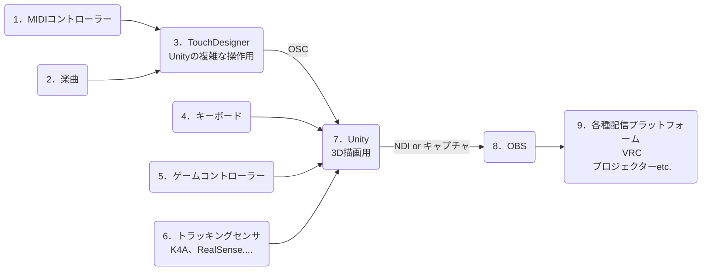

# 3DLiveSystem
3Dライブを行うためのシステムを開発します。

## はじめに
お疲れ様です。柊　弥生です。普段は、Unityでゲーム作りながらゲーム業界のエンジニア就活をしている学生です。
ここでは、3Dライブ環境を作成するプロジェクトを始動します。システムの最終目標と概要についてまとめます。

## きっかけ
安価で3Dライブのシステムを構築する理由は、近年の大手VTuber事務所が行っているクソ強ライブを見て頑張れば個人でもできるのではないかと考えたからです。（に○さ○じ、ホ○ラ○ブetc.）基礎技術は難しくないのに個人で制作している人を見かけないので作ってやるか！という勢いで始めます。

## 最終目標
最終目標は、PAがワンオペでも運用できるYouTubeでの3Dライブ環境を完成させることです。（2～3時間連続で配信しても耐えうる環境）  
クオリティとしては、大手のVTuber事務所が行っている記念ライブ配信ぐらいのレベルを目指します。
### 参考例

実写合成やりたい↓ リアルタイムでできたら最高だよね  

といっても流石に**複数人を同時にトラッキング**させたり、**縄跳び**させたりするのはハードルが高いので、初めは以下の演目のみ**リアルタイムトラッキング**させます。
- 歌唱
- トークショー
- バンド演奏

**非リアルタイム**なら以下の項目も行います。
- ダンス
- 演劇

### システム全体像

**1**：主要な操作はMIDIコントローラーを用いて行います。  
	楽曲ミックス、照明操作、映像操作 etc.  
**3**：Unityの複雑な操作はTouchDesignerが制御する。  
**6**：トラッキングセンサはK4Aを用意している。開発中止しているため、他のセンサも検討予定  
**7**：音と映像をまとめる。激重処理はUnityに任せる。  
**8**：配信するなら必須  
**9**：出力先は柔軟性をもたせるようにする。（メインはライブ配信）  

## 現状の持ち駒について
ここまで壮大な目標を掲げていますが、私は過去にAzure Kinectでトラッキングして遊んでいたり、MMDをUnityに置き換えて遊んでいたりします。また、TouchDesignerを使ってDJ卓をMIDIコントローラーで再現したりしました。  
さらに、普段はUnityで格闘ゲームの制作チームを総監督兼エンジニアとして率いています。個々の技術レベルは高いとは言えませんが、多岐にわたり技術に触れてきたので、今回のような様々な技術分野を必要とする企画は適していると考えています。

### 実は少し進んでいることも....
私は、AzureKinect（以降は、K4Aとする）を使って簡易的なフルトラをして、Unity内でアニメーションさせていました。サンプルプロジェクトを改造してUnityのAnimation Clipにベイクするところまで行っていましたが、K4A単体での精度に難があるため、モーションの修正が必須でした。（しかもK4Aは開発終了しています）  
また、OpenPoseと複数台のカメラを用いてフルトラできないか複数人で制作したこともあります。しかし、OpenPoseが2D情報しか返さないこと、深度情報が存在しないこと、スタンドアローンでの運用を想定していたことが重なり、諦めてしまいました。格ゲーの制作で使えればよかったのですが、私の技術力では時間がかかりすぎました。

このように一部進んでいることもあります。これらの経験をもとに3Dライブのシステムとして完成させたいです。

